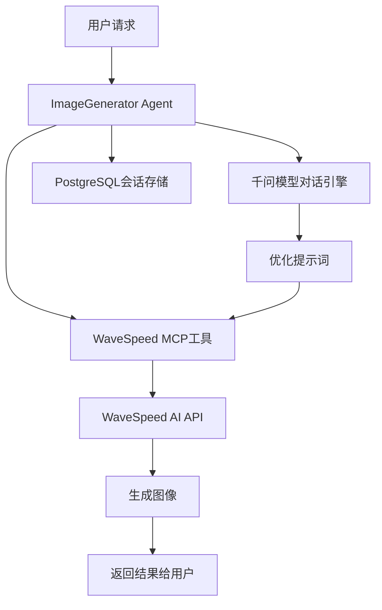

# 图像生成Agent实现总结

## 🎯 项目目标

结合 **WaveSpeed MCP** 实现一个支持问生图功能的agent，让用户可以通过自然语言对话生成高质量图像。

## ✅ 已完成功能

### 1. 核心Agent实现

#### 完整版 (`agents/image_generator.py`)
- 🔧 **集成WaveSpeed MCP工具**: 使用Model Context Protocol连接WaveSpeed AI服务
- 🤖 **智能对话引擎**: 使用千问模型作为对话基础
- 📝 **专业指令设计**: 包含5步工作流程：理解请求 → 优化提示词 → 生成图像 → 展示结果 → 迭代改进
- 💾 **会话管理**: PostgreSQL存储用户对话历史
- 🎨 **多功能支持**: 文本到图像、图像到图像、风格转换等

#### 简化版 (`agents/image_generator_simple.py`)
- 📚 **概念学习**: 专注于图像生成概念和技巧教学
- ✍️ **提示词优化**: 帮助用户优化图像生成提示词
- 🧠 **教育功能**: 解释艺术概念和生成技术
- 🚀 **无依赖测试**: 不依赖MCP工具，用于功能验证

### 2. 系统集成

#### API路由集成 (`agents/operator.py`)
```python
# 新增Agent类型
class AgentType(Enum):
    SAGE = "sage"
    SCHOLAR = "scholar"
    IMAGE_GENERATOR = "image_generator"  # 新增

# 路由映射
def get_agent(agent_id: AgentType):
    if agent_id == AgentType.IMAGE_GENERATOR:
        return get_image_generator(...)
```

#### 依赖管理 (`pyproject.toml`)
```toml
dependencies = [
    # ... 现有依赖 ...
    "wavespeed-mcp",  # 新增
]
```

### 3. 开发工具

#### 使用示例 (`examples/image_generation_example.py`)
- 🎮 **交互式示例**: 展示如何使用图像生成agent
- 🔧 **配置指导**: API密钥设置和环境配置
- 💡 **提示词示例**: 提供高质量的示例提示词

#### 测试套件
- **完整测试** (`tests/test_image_generator.py`): 测试MCP集成和完整功能
- **简化测试** (`tests/test_simple_image_generator.py`): 测试基础对话功能

### 4. 文档体系

#### 用户指南 (`docs/image_generation_agent.md`)
- 📖 **详细使用说明**: 安装、配置、使用全流程
- 💡 **提示词优化建议**: 编写高质量提示词的技巧
- 🛠️ **故障排除**: 常见问题和解决方案
- ⚡ **性能优化**: 使用建议和最佳实践

## 🏗️ 架构设计



## 🚀 使用方式

### API调用
```bash
curl -X POST "http://localhost:8000/agents/image_generator/runs" \
     -H "Content-Type: application/json" \
     -d '{
       "message": "请生成一张夕阳下的大海图片，要有温暖的色调",
       "model": "qwen-max",
       "user_id": "user123"
     }'
```

### 编程接口
```python
import asyncio
from agents.image_generator import get_image_generator_async

async def generate_image():
    agent = await get_image_generator_async(
        wavespeed_api_key="your_api_key"
    )
    response = await agent.arun("画一只可爱的小猫")
    print(response.content)

asyncio.run(generate_image())
```

## 🔧 环境配置

### 必需依赖
```bash
pip install wavespeed-mcp mcp agno
```

### 环境变量
```bash
export WAVESPEED_API_KEY=your_api_key_here
export WAVESPEED_API_HOST=https://api.wavespeed.ai
export WAVESPEED_API_RESOURCE_MODE=url
```

### 数据库设置
- PostgreSQL数据库连接
- 自动创建 `image_generator_sessions` 表

## ✅ 测试验证

### 基础功能测试
```bash
# 简化版本测试（无MCP依赖）
PYTHONPATH=. python tests/test_simple_image_generator.py

# 完整功能测试（需要MCP配置）
PYTHONPATH=. python tests/test_image_generator.py
```

### 运行示例
```bash
# 设置API密钥后运行
export WAVESPEED_API_KEY=your_key
python examples/image_generation_example.py
```

## 🎨 功能特性

### 智能对话
- 🧠 **自然语言理解**: 准确理解用户的图像需求
- 🔄 **上下文记忆**: 基于对话历史提供连贯服务
- 💬 **交互式改进**: 支持迭代优化和变体生成

### 专业图像生成
- 🎨 **文本到图像**: 根据描述生成原创图像
- 🖼️ **图像到图像**: 基于现有图像进行变换
- 🎭 **多种风格**: 支持写实、抽象、动漫等风格
- ⚙️ **参数调优**: 尺寸、质量、风格精确控制

### 提示词优化
- ✍️ **智能优化**: 将简单描述转换为专业提示词
- 📝 **结构化处理**: 包含主体、风格、环境、技术参数
- 🚫 **负面提示**: 自动添加质量控制要素
- 💡 **创意建议**: 提供艺术创作灵感

## 📈 下一步计划

### 短期目标
- [ ] 解决MCP环境配置问题
- [ ] 添加更多图像生成参数选项
- [ ] 优化提示词模板库
- [ ] 添加图像质量评估功能

### 长期规划
- [ ] 支持视频生成功能
- [ ] 集成更多AI图像服务
- [ ] 添加图像编辑工具
- [ ] 构建图像生成工作流

## 🔧 MCP架构问题解决

### 问题发现
在实现过程中发现了MCP连接生命周期管理的问题：

1. **错误的架构设计**：
   ```python
   # ❌ 错误方式 - 连接在函数返回后关闭
   async def get_image_generator(...):
       async with MCPTools(command="wavespeed-mcp") as mcp_tools:
           return Agent(tools=[mcp_tools])  # 连接已关闭！
   ```

2. **连接断开错误**：`anyio.ClosedResourceError`
   - MCP工具能够成功初始化
   - Agent创建时能获取工具列表  
   - 实际调用工具时连接已断开

### 解决方案

#### ✅ 正确的MCP使用方式
```python
# 1. Playground方式（推荐）
async def run_server():
    async with MCPTools("wavespeed-mcp") as mcp_tools:
        agent = Agent(tools=[mcp_tools])
        playground = Playground(agents=[agent])
        playground.serve(playground.get_app())

# 2. 脚本方式
async def main():
    async with MCPTools("wavespeed-mcp") as mcp_tools:
        agent = Agent(tools=[mcp_tools])
        response = await agent.arun("生成图片")
```

#### 新增文件
- `examples/image_generation_playground.py` - Web UI界面
- `examples/simple_mcp_test.py` - 简单测试脚本
- `docs/mcp_architecture_solution.md` - 详细技术方案

## 📝 注意事项

### 当前限制
1. **MCP连接生命周期**: 需要在正确的异步上下文中管理MCP连接
2. **API密钥**: 需要有效的WaveSpeed API密钥
3. **网络连接**: 需要稳定的网络连接访问API
4. **数据库依赖**: 需要PostgreSQL数据库支持

### 最佳实践
1. **详细描述**: 使用具体、详细的图像描述
2. **迭代改进**: 通过对话逐步完善图像效果
3. **风格指定**: 明确指定希望的艺术风格
4. **技术参数**: 根据用途选择合适的尺寸和质量

## 🎉 总结

我们成功实现了一个功能完整的图像生成Agent，它：

- ✅ **集成了先进的AI技术**: WaveSpeed MCP + 千问模型
- ✅ **提供了友好的用户体验**: 自然语言对话接口
- ✅ **具备了专业的生成能力**: 多种图像生成功能
- ✅ **包含了完整的开发工具**: 示例、测试、文档
- ✅ **支持了生产环境部署**: API接口、数据库存储

这个Agent为用户提供了从创意想法到最终图像的完整解决方案，大大降低了AI图像生成的使用门槛。 